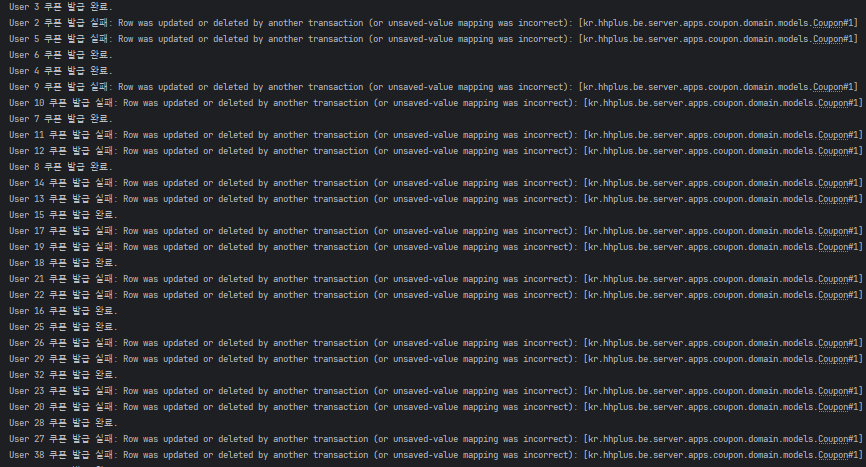
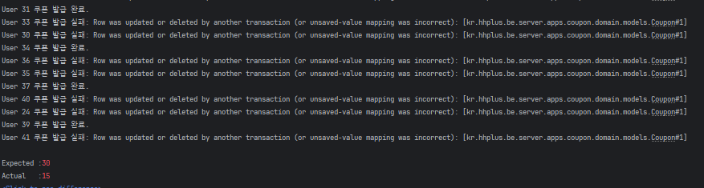

# 이커머스 서비스

## 문서 목차

---
1. [Milestone](./docs/milestone.md)
2. [Sequence Diagram](./docs/sequence_diagram.md)
3. [flow chart](./docs/flow_chart.md)
4. [erd](./docs/erd.md)
5. [API specification](./docs/api_specification.md)
6. [project structure](./docs/project_structure.md)
7. [swagger](./docs/swagger.md)

**test 조건**
docker desktop 실행 , local mysql 중지(포트겹침)

### 2주차 회고
- 2주차는 직접 ecommerce 서비스를 개발해보는것 입니다
- 최대한 욕심 부리지 않고 할거만 하고자 했습니다.
- 문서작업, 설계 , 계획수립, 개발의 과정을 경험해볼 수 있었습니다.
- 개발하며 설계의 중요성 또 api문서화의 중요성도 깨달을 수 있었습니다.
- 로직을 꾸준히 수정해야 했기 때문에 유지 보수의 중요성도 알 수 있었습니다.
- 현재 락은 db락을 통한 비관적락으로 동시성을 제어중입니다.

이 부분을 더 develop 시키고자 합니다 또한 도메인 책임 분리도 더 명확히 수정할 계획입니다.

현재 개발 상황은 다음과 같습니다.
- 유저
  - 잔액조회, 충전
- 상품
  - 목록 조회, 개별조회
- 주문
  - 주문
- 쿠폰
  - 발급, 조회
- 통계
  - 판매량 top 5
- filter , exception

### 동시성 제어
**선착순 쿠폰 발급**
선착순 쿠폰 발급 API는 동시성 처리를 반드시 고려해야 하는 기능입니다.

이 API는 여러 사용자의 요청을 선착순으로 처리하며, 
정해진 쿠폰 수량만 정확하게 발급해야 합니다. 다수의 사용자가 동시에 요청을 보낼 경우, 요청이 겹치면서 데이터 충돌이나 초과 발급 문제가 발생할 수 있으므로,
이를 방지하기 위한 철저한 동시성 제어가 필요합니다

쿠폰 발급의 경우 정확한 개수와 선착순 처리가 필수적입니다.

낙관적 락의 경우 정확히 30개의 개수를 보장하기는 어렵습니다.

낙관적 락은 version 필드를 사용해 업데이트를 관리합니다. version 값이 동일한 경우에만 업데이트가 가능하며, 그렇지 않으면 업데이트가 실패합니다. 
따라서 초기에 SELECT 시점에서 가져온 version 정보가 매우 중요합니다.

만약 동시에 20개의 쓰레드가 쿠폰 발급 요청을 보내면, 모두 동일한 version 값을 (0) 갖게 됩니다. 이
때, 하나의 쓰레드가 성공적으로 업데이트를 수행하면 version 값이 증가하며, 나머지 19개의 쓰레드는 version 값 불일치로 인해 업데이트가 실패하는 구조입니다.

결과적으로, 40개의 요청 중 30개의 성공을 보장할 수는 있지만, 정확히 30개의 성공을 보장하려면 재시도 로직을 구현해야 합니다.

요청이 오는 순서대로 완료가 되는것이 아니라
완료 -> 실패 -> 실패 -> 완료 이런 형식으로 version 값에 따라 성공 실패가 달라지는것을 확인 할 수 있습니다.
따라서 결과가 30을 기대했지만 15의 성공이 일어났습니다.

비관적 락을 사용하는 경우, 정확히 30개의 쿠폰 발급과 선착순 처리를 효과적으로 보장할 수 있습니다.

비관적 락은 데이터베이스에서 행 단위로 락을 걸어 다른 트랜잭션이 동시에 해당 데이터를 수정하거나 읽는 것을 차단합니다. 
따라서 요청이 동시에 들어와도 락이 설정된 순서대로 요청이 처리되며, 선착순 처리가 가능합니다.

만약 동시에 20개의 쓰레드가 쿠폰 발급 요청을 보낸 경우, 비관적 락이 설정된 상태에서 하나의 쓰레드만 데이터를 수정할 수 있습니다. 
다른 쓰레드들은 락이 해제될 때까지 대기하며, 락이 해제된 후 순차적으로 요청을 처리합니다. 
이 과정에서 데이터베이스의 락 대기 큐가 순서를 관리하므로, 정확히 30개의 쿠폰이 발급되도록 제어할 수 있습니다.

결과적으로, 비관적 락을 사용하면 선착순 처리를 보장하고, 정확히 30개의 쿠폰 발급을 안정적으로 관리할 수 있습니다. 
추가적인 재시도 로직은 필요하지 않으며, 락 대기와 트랜잭션 관리를 통해 동시성 문제를 해결합니다.