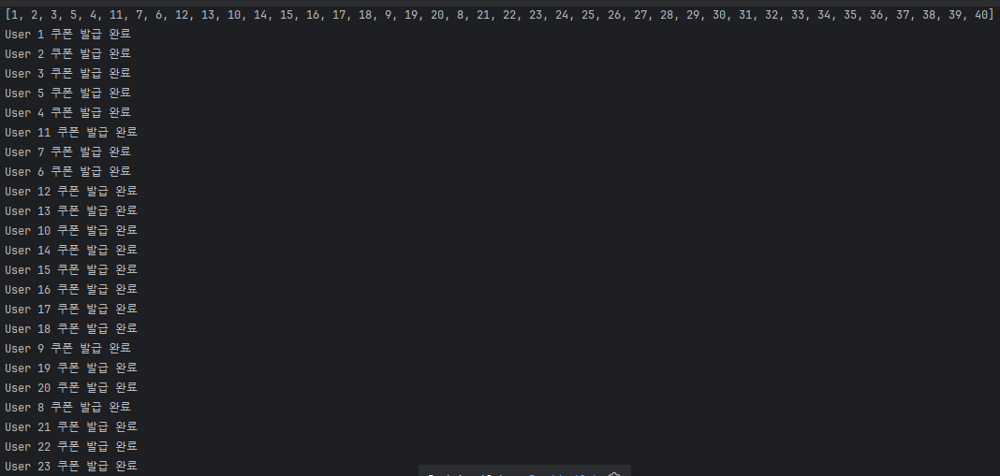
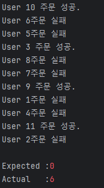
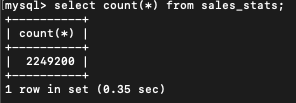
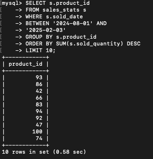
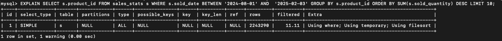
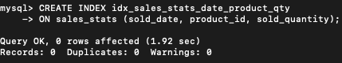
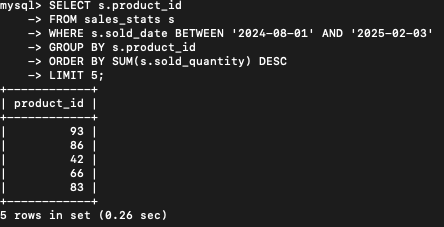
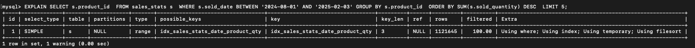
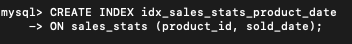
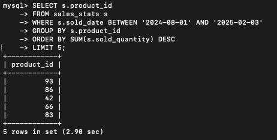

# 이커머스 서비스

## 문서 목차

---
1. [Milestone](./docs/milestone.md)
2. [Sequence Diagram](./docs/sequence_diagram.md)
3. [flow chart](./docs/flow_chart.md)
4. [erd](./docs/erd.md)
5. [API specification](./docs/api_specification.md)
6. [project structure](./docs/project_structure.md)
7. [swagger](./docs/swagger.md)
8. [DB인덱스](#8-db인덱스)


**test 조건**
docker desktop 실행 , local mysql 중지(포트겹침)


### 2주차 회고
- 2주차는 직접 ecommerce 서비스를 개발해보는것 입니다
- 최대한 욕심 부리지 않고 할거만 하고자 했습니다.
- 문서작업, 설계 , 계획수립, 개발의 과정을 경험해볼 수 있었습니다.
- 개발하며 설계의 중요성 또 api문서화의 중요성도 깨달을 수 있었습니다.
- 로직을 꾸준히 수정해야 했기 때문에 유지 보수의 중요성도 알 수 있었습니다.
- 현재 락은 db락을 통한 비관적락으로 동시성을 제어중입니다.

이 부분을 더 develop 시키고자 합니다 또한 도메인 책임 분리도 더 명확히 수정할 계획입니다.

현재 개발 상황은 다음과 같습니다.
- 유저
  - 잔액조회, 충전
- 상품
  - 목록 조회, 개별조회
- 주문
  - 주문
- 쿠폰
  - 발급, 조회
- 통계
  - 판매량 top 5
- filter , exception

### 동시성 제어
**선착순 쿠폰 발급**
선착순 쿠폰 발급 API는 동시성 처리를 반드시 고려해야 하는 기능입니다.

이 API는 여러 사용자의 요청을 선착순으로 처리하며, 
정해진 쿠폰 수량만 정확하게 발급해야 합니다. 다수의 사용자가 동시에 요청을 보낼 경우, 요청이 겹치면서 데이터 충돌이나 초과 발급 문제가 발생할 수 있으므로,
이를 방지하기 위한 철저한 동시성 제어가 필요합니다

**낙관적락**

쿠폰 발급의 경우 정확한 개수와 선착순 처리가 필수적입니다.

낙관적 락의 경우 정확히 30개의 개수를 보장하기는 어렵습니다.

낙관적 락은 version 필드를 사용해 업데이트를 관리합니다. version 값이 동일한 경우에만 업데이트가 가능하며, 그렇지 않으면 업데이트가 실패합니다. 
따라서 초기에 SELECT 시점에서 가져온 version 정보가 매우 중요합니다.

만약 동시에 20개의 쓰레드가 쿠폰 발급 요청을 보내면, 모두 동일한 version 값을 (0) 갖게 됩니다. 이
때, 하나의 쓰레드가 성공적으로 업데이트를 수행하면 version 값이 증가하며, 나머지 19개의 쓰레드는 version 값 불일치로 인해 업데이트가 실패하는 구조입니다.

결과적으로, 40개의 요청 중 30개의 성공을 보장할 수는 있지만, 정확히 30개의 성공을 보장하려면 재시도 로직을 구현해야 합니다.


요청이 오는 순서대로 완료가 되는것이 아니라
완료 -> 실패 -> 실패 -> 완료 이런 형식으로 version 값에 따라 성공 실패가 달라지는것을 확인 할 수 있습니다.
따라서 결과가 30을 기대했지만 15의 성공이 일어났습니다.

**비관적락**

비관적 락을 사용하는 경우, 정확히 30개의 쿠폰 발급을 효과적으로 보장할 수 있습니다.

비관적 락은 데이터베이스에서 행 단위로 락을 걸어 다른 트랜잭션이 동시에 해당 데이터를 수정하거나 읽는 것을 차단합니다. 
따라서 요청이 동시에 들어와도 락이 설정된 순서대로 요청이 처리되며, 선착순 처리가 가능합니다.

만약 동시에 20개의 쓰레드가 쿠폰 발급 요청을 보낸 경우, 비관적 락이 설정된 상태에서 하나의 쓰레드만 데이터를 수정할 수 있습니다. 
다른 쓰레드들은 락이 해제될 때까지 대기하며, 락이 해제된 후 순차적으로 요청을 처리합니다. 
이 과정에서 데이터베이스의 락 대기 큐가 순서를 관리하므로, 정확히 30개의 쿠폰이 발급되도록 제어할 수 있습니다.

결과적으로, 비관적 락을 사용하면 정확히 30개의 쿠폰 발급을 안정적으로 관리할 수 있습니다. 
추가적인 재시도 로직은 필요하지 않으며, 락 대기와 트랜잭션 관리를 통해 동시성 문제를 해결합니다.


요청을 차례대로 처리하며 정확히 30개의 완료 후 나머지 요청에는 실패를 하는것을 알 수 있습니다.

하지만 정확히 1~30까지의 선착순처리는 안된것을 확인할 수 있습니다.

선착순을 위해 요청을 queue 에 쌓고 하나씩 꺼내 처리하도록 테스트 코드를 수정하였습니다



queue에 쌓인 요청 순서 대로 userId를 처리하는 것을 볼 수 있습니다.

### 주문 요청 ###
**낙관적락**

주문요청의 경우 정확한 재고관리와 선착순 처리가 필수적입니다.
따라서 저는 11명의 주문 요청이 재고가 10개인 상품을 주문하는 것을 테스트 해봤습니다.

만약 동시에 11개의 쓰레드가 주문 요청을 보내면, 모두 동일한 version 값을 (0) 갖게 됩니다. 이
때, 하나의 쓰레드가 성공적으로 업데이트를 수행하면 version 값이 증가하며, 나머지 19개의 쓰레드는 version 값 불일치로 인해 업데이트가 실패하는 구조입니다.

결과적으로, 11개의 요청 중 10개의 이하의 성공 보장할 수는 있지만, 정확히 30개의 성공을 보장하려면 재시도 로직을 구현해야 합니다.



**비관적락**

비관적 락을 사용하는 경우, 정확히 10개의 주문처리를 보장할 수 있습니다.

만약 동시에 11개의 쓰레드가 주문 요청을 보낸 경우, 비관적 락이 설정된 상태에서 하나의 쓰레드만 데이터를 수정할 수 있습니다. 
다른 쓰레드들은 락이 해제될 때까지 대기하며, 락이 해제된 후 순차적으로 요청을 처리합니다. 
이 과정에서 데이터베이스의 락 대기 큐가 순서를 관리하므로, 정확히 10개의 주문이 처리되도록 제어할 수 있습니다.

결과적으로, 비관적 락을 사용하면 정확히 10개의 주문 요청을 안정적으로 관리할 수 있습니다. 
추가적인 재시도 로직은 필요하지 않으며, 락 대기와 트랜잭션 관리를 통해 동시성 문제를 해결합니다.
하지만 이 역시 선착순 처리는 하지 못한 것을 확인 할 수 있습니다,


선착순을 위해 요청을 queue 에 쌓고 하나씩 꺼내 처리하도록 테스트 코드를 수정하였습니다


queue에 쌓인 요청 순서 대로 userId를 처리하는 것을 볼 수 있습니다.

### 추가 개발사항

- 현재 테스트 코드내에서 요청을 큐에 쌓고 진행했습니다.
- 이걸 실제 controller 단위에서 어떻게 큐에 쌓을건지 고민을 해볼것입니다.
- 비관적락은 db락으로 성능에 영향이 있을 수 있기때문에 다른 lock도 고민해볼것입니다.

### 캐시 

- 캐시 데이터나 값을 미리 복사해놓는 임시 저장소

**캐시 전략 패턴**
 

Application - cache - database

Application - cache (데이터가 있다면 해당 데이터 바로 반환 이를 cache hit)
			(원하는 데이터가 없다 -> db를 직접 찾아가서 반환 이를 cache miss)


**캐시 전략 패턴 - 읽기 전략**

Look aside (보다 옆(곁)을)
어플리케이션 - 캐시에 데이터가 있다면 캐시에서 데이터를 가져옴
 		- 캐시에 데이터가 없다면 곁을 봐서 db에서 데이터를 가져옴 - > 케시에 올려놓고 사용함

장점 - 캐시에 문제가 생기는 경우 db로 요청을 위임해서 데이터를 가져올 수 있음
단점 - 캐시, db를 잇는 연결점이 없어서 정합성 유지가 어려움, 또한 첫 번째 조회를 할 때는 항상 db로부터 데이터를 가져와서 캐시에 올려놓고 사용하므로 db에 부하 발생

Read through (읽다 통하여)

어플리케이션 - 캐시에 데이터가 있다면 캐시에서 데이터를 가져옴 
		- 캐시에 데이터가 없다면 캐시가 db에서 데이터를 직접 가져옴 그 데이터를 어플리케이션이 읽음

장점 - 캐시와 db 간의 연결점이 있어 데이터의 정합성이 보장됨
단점 - 캐시가 죽어버리면 어플리케이션도 문제가 생김

**쓰기 전략**
Write Around( 쓰다 우회)

캐시를 우회해서 직접 쓴다
어플리케이션 - db에 직접 쓴다
읽기 전략과 혼합해서 사용하면 캐시 미스가 일어났을 떄 직접 캐시 스토어에 쓰기도 함
장점 - 성능이 좋음 직접 db에 쓰기 때문, 불필요한 데이터를 캐시에 올리지 않음 리소스를 아낌, 캐시를 거치지 않아 성능이 좋음
단점 - 캐시와 db에 연결점이 없기 때문에 데이터 정합성 유지가 어렵다

Write back(쓰다 나중에)
캐시에 데이터를 한꺼번에 써놓고 나중에 db에 쓰기 작업

어플케이션 - 캐시에 많은 양의 데이터를 쓰기 작업-> 그 후 스케쥴링을 통해 db에 쓰기 작업 진행 
장점 - 쓰기 횟수 비용 줄일 수 있음 (스케쥴링을 통해 하나의 insert문으로 데이터를 묶어 쓰기 작업)
단점 - 캐시의 데이터 유실 문제(캐시 스토어에만 데이터를 쌓아놓은 상태에서 캐시가 죽어버리면 데이터가 db까지 직접 써지지 않음)

Write through(쓰다 통해서)
캐시를 통해서 쓰기를 진행
어플리케이션이 캐시에 먼저쓰고 db에 씀
장점 - 데이터 정합성이 보장됨 (캐시를 거치고 데이터베이스로 가기때문에)
단점 - 두번의 쓰기가 일어나기 때문에 성능 문제

**캐시 스탬피드 현상**
대량의 캐시 만료로 인해 모든 요청이 동시에 db로 몰리는 현상

발생 원인
 - 캐시가 만료되면 같은 데이터를 조회하려는 다수의 요청이 동시에 db에 몰려 성능 저하가 발생
- 트래픽이 많은 서비스에서 발생할 가능성이 높음 (예: 인기 상품, 이벤트 페이지)

해결 방법

	1	캐시 만료 시간(Random Expiration Time) 적용
	◦	모든 캐시가 같은 시간에 만료되지 않도록, 만료 시간을 랜덤하게 설정
	2	Lazy Loading + Mutex Lock 사용
	◦	특정 요청이 DB에서 데이터를 가져올 때, 다른 요청이 같은 작업을 수행하지 못하도록 락(lock) 적용
	◦	예: SETNX(Redis), Redisson Lock 활용
	3	Double Caching (이중 캐싱)
	◦	기존 캐시가 만료되더라도, 백업 캐시를 사용하여 갑작스러운 부하를 방지
	◦	예: 메모리 캐시(Redis) + 디스크 캐시 활용

1. 인기 판매 리스트 API → DB 조회에서 Redis 캐싱으로 변경

문제점 
  •	인기 상품 리스트는 동일한 데이터를 반복적으로 조회하는 요청이 많음


	•	매번 DB에서 조회하면 트래픽 증가 및 부하 발생
        인기 상품 리스트는 동일한 데이터를 반복적으로 조회하는 요청이 많음 
	•	높은 트래픽 시 DB 부하로 인해 응답 속도 저하 가능

레디스 활용

	•	읽기 성능 개선 → 동일한 요청을 캐시에서 바로 반환 (DB 부하 감소)
	•	TTL(Time To Live) 설정 가능 → 일정 시간마다 최신 데이터로 갱신 가능
	•	빠른 응답 시간 제공 → DB 접근 없이 Redis에서 바로 응답 가능

2. 쿠폰 발급 → 비관적 락(Pessimistic Lock)에서 Redis로 변경

문제점(비관적 락)

	•	트랜잭션 충돌 빈번: 쿠폰 발급 요청이 많아지면 락 경합이 발생하여 성능 저하
	•	DB 부하 증가: 모든 쿠폰 발급 요청이 DB에서 트랜잭션을 발생시킴
	•	확장성 문제: 동시 요청이 많을 경우 데드락(Deadlock) 위험 존재

레디스 활용

	•	Redis의 원자적 연산(DECR)을 활용하면 락 없이 동시성 보장
	•	쿠폰 재고를 Redis에서 관리하면 빠르게 감소 처리 가능
	•	DB 트랜잭션이 발생하지 않으므로 성능 향상
	•	TTL 설정을 통해 특정 시간 이후 자동 만료 가능

 

# 8. DB인덱스

### 1. 인덱스란

**1.1 인덱스란**
- 인덱스는 데이터베이스 테이블의 검색 속도를 향상시키기 위한 자료구조로 백과사전의 색인과 비슷
- 저장되는 컬럼의 값을 사용하여 항상 정렬된 상태를 유지하는 것이 특징, 이러한 특징으로 인해 인덱스는 INSERT, UPDATE, DELETE의 성능이 희생된다는 단점이 잇음.

**1.2 인덱스 자료구조**

MySQL 기준으로 B+Tree와 같은 변형 B-Tree 자료구조를 이용해서 인덱스를 구현
기본 토대인 B-Tree 인덱스는 컬럼의 값을 변형하지 않고 인덱스 구조체 내에서 항상 정렬된 상태로 유지합니다.

B-Tree(Balanced-Tree)에서는 크게 3가지 노드 존재. 
최상위에 하나의 루트 노드가 존재하며, 가장 하위 노드인 리프 노드가 존재. 이 두 노드의 중간에 존재하는 브랜치 노드가 존재. 
최하위 노드인 리프 노드에는 실제 데이터 레코드를 찾아가기 위한 주소값을 가지고 있음


**1.3 MySQL 스캔 방식**
MySQL에는 크게 인덱스 레인지 스캔, 인덱스 풀 스캔, 루스 인덱스 스캔 방식이 있음

인덱스 레인지 스캔
- 검색할 인덱스 범위가 결정되었을 경우 사용하며 가장 빠른특징.
 
- 인덱스에서 조건을 만족하는 값이 저장된 시작 리프 노드를 찾음(index seek)
- 시작 리프 노드부터 필요한 만큼 인덱스를 차례대로 읽음 (index scan)
- 인덱스 키와 레코드 주소를 이용해 저장된 페이지를 가져오고 레코드를 읽어옴.
- 레코드를 읽어오는 과정에서 랜덤 IO가 발생할 수 있음.
- 읽어야할 데이터 레코드가 전체 20-25%의 경우에는 풀 테이블 스캔(순차 IO를 이용)이 더욱 효과적일 수 있다.

인덱스 풀 스캔
- 인덱스를 사용하지만 인덱스를 처음부터 끝까지 모두 읽는 방식입니다.

- 인덱스를 ABC 순서로 만들었는데 조건절에 B 혹은 C로 검색하는 경우 사용
- 인덱스를 생성하는 목적은 아니지만, 그래도 풀 테이블 스캔보다는 낫다.

루스 인덱스 스캔
- 듬성듬성하게 인덱스를 읽는 것을 의미
- 중간에 필요하지 않은 인덱스 키 값은 무시하고 다음으로 넘어가는 형태로 처리
- group by, max(), min() 함수에 대해 최적화하는 경우에 사용


### 2. 쿼리 분석
**2.1 주요 쿼리 분석**

분석 대상 Repository 및 주요 쿼리:
- **CouponJpaRepository**  
  - `findCouponByCouponIdWithLock`
  - `findCouponByCouponId`
- **UserCouponJpaRepository**  
  - `findByUserIdAndCouponId`
  - `findAllByUserId`
- **ProductJpaRepository**  
  - `findProductByProductId`
  - `findAll(Pageable pageable)`
  - `findByIdWithLock`
- **SalesStatsJpaRepository**  
  - `findTopSellingProductIds` (조건: sold_date ≥ :startDate, 또는 BETWEEN :startDate AND :endDate)
  - `updateSalesStats` (ON DUPLICATE KEY UPDATE 사용)
- **UserPointJpaRepository**  
  - `findUserPointByUserIdWithLock`
  - `findUserPointByUserId`

**2.2 쿠폰 관련 쿼리**

**쿼리:** `SELECT c FROM Coupon c WHERE c.couponId = :couponId`  

**용도:** 쿠폰 조회 (락 버전/락 미사용 버전)  

**인덱스 고려 :**  
  - `couponId`는 PK 으로 기본 인덱스 설정이되므로 별도 인덱스 추가가 필요 없음


**2.3 UserCoupon 관련 쿼리**

- **쿼리:** `findByUserIdAndCouponId(Long userId, Long couponId)` 

  **용도:** 특정 사용자와 쿠폰 조합으로 조회  

- **쿼리:** `findAllByUserId(Long userId)`  

  **용도:** 특정 사용자의 모든 쿠폰 조회 

**인덱스 고려 :**  
  - user_id 가 pk는 아니지만 단순 조회에 쓰이기 때문에 인덱스 불필요할 것으로 예상
  - user_id, coupon_id 가 pk는 아니지만 단순 조회에 쓰이기 때문에 인덱스 불필요할 것으로 예상

**2.4 Product 관련 쿼리**

- **쿼리:** `findProductByProductId(Long productId)` 

  **용도:** 특정 상품을 상품 ID로 조회

- **쿼리:** `findByIdWithLock(Long productId)`  

  **용도:** 특정 상품을 상품 ID로 조회(비관적락)

- **쿼리:** `findAll(Pageable pageable)`  

  **용도:** 상품 조회 페이지 네이션 이용


**인덱스 고려 :**  
  - `productId`는 PK 으로 기본 인덱스 설정이되므로 별도 인덱스 추가가 필요 없음
  - `pagenation` 자체에 limit가 걸려있어 추가 적인 설정 필요 없음


**2.5 Sales 관련 쿼리**

- **쿼리:** `findTopSellingProductIds` 

  **용도:** 날짜 범위 별 인기 상품을 조회한다

- **쿼리:** `updateSalesStats`  

  **용도:** 상품 판매가 일어나면 통계테이블의 상품 수량을 업데이트한다

**인덱스 고려 :**  
  - sold_date 필드가 날짜 범위로 필터링에 사용되므로 인덱스가 필요
  - product_id는 그룹화에 사용되므로 인덱스가 필요
  - SUM(s.sold_quantity) DESC에서 정렬이 필요하므로 해당 필드에 대한 인덱스가 유리할 수 있음

**2.6 UserPoint 관련 쿼리** 

- **쿼리:** `findUserPointByUserIdWithLock` 

  **용도:** 유저 포인트를 유저ID로 조회한다 (비관적락)
- **쿼리:** `findUserPointByUserId`  

  **용도:** 유저포인트를 유저ID로 조회한다

**인덱스 고려 :**  
  - user_id 가 pk는 아니지만 단순 조회에 쓰이기 때문에 인덱스 불필요할 것으로 예상

### 3. 문제 쿼리 분석

```sql
SELECT s.product_id 
FROM sales_stats s 
WHERE s.sold_date BETWEEN :startDate AND :endDate 
GROUP BY s.product_id 
ORDER BY SUM(s.sold_quantity) DESC 
LIMIT :topN
```
**3.1 쿼리분석**

날짜 범위 조회 (BETWEEN)
GROUP BY를 통한 집계
ORDER BY와 집계 함수(SUM) 사용
LIMIT을 통한 결과 제한

**3.2 인덱스 적용**

2.1 인덱스 적용전 실행 계획 및 시간
- 기본 데이터 준비 (200만건)



 - 출력 시간


 
 - explain



- db에서 직접 조회하는 경우 0.58 초 정도가 소요되며
실제 spring 을 활용해 조회할 경우 connection, 
다른 로직 처리등을 진행하면 이 쿼리에 해당하는 api는 1초이상의 시간이 소요될것으로 예상돼 불편을 줄수 있음


 -> 인덱스를 이용해 개선 필요
- 복합 인덱스 설정



- 쿼리 조회 결과



(0.58 -> 0.26 ) 줄어든 것 확인



하지만 3개의 복합인덱스를 걸어뒀기 때문에 Using temporary; Using filesort는 유지되는 것을 알 수 있음

ORDER BY 절에 사용된 SUM(sold_quantity)는 집계 함수이기 때문에, 인덱스만으로 미리 정렬된 값을 얻을 수 없음

즉, WHERE와 GROUP BY는 커버링 인덱스로 최적화할 수 있지만,
ORDER BY SUM(sold_quantity) DESC는 각 그룹의 합을 계산한 후 정렬해야 하므로,
임시 테이블과 파일 소트가 발생하는 것을 완전히 없애기는 어려움.


인덱스를 다르게 걸었을 떄의 차이를 알 수 있게 인덱스 설정을 수정 해봄

product_id, sold_date 순서로 인덱스 설정

- 복합 인덱스 설정



- 쿼리 조회 결과



오히려 2초로 늘어났음을 확인

**결론**
#### 1. 단일 인덱스 (sold_date)
- **구성**:  
  인덱스에 `sold_date`만 포함

- **WHERE 절**:  
  - `sold_date` 범위 조건에 대해 인덱스 스캔으로 빠르게 필터링 가능

- **GROUP BY 및 집계**:  
  - 인덱스에 `product_id`와 `sold_quantity`가 없으므로,  
    필터링 후 각 행의 해당 컬럼을 가져오기 위해 추가적인 테이블 데이터 페이지 조회가 필요

- **결과**:  
  - WHERE 조건은 최적화되지만, GROUP BY와 집계 시 추가 조회로 인한 오버헤드가 발생하여 전체 성능이 떨어질 가능성이 있음

---

#### 2. 복합 인덱스 (sold_date, product_id, sold_quantity)
- **구성**:  
  인덱스에 `sold_date`, `product_id`, `sold_quantity`가 순서대로 포함

- **WHERE 절**:  
  - 인덱스의 첫 번째 컬럼인 `sold_date`로 날짜 범위 필터링이 효율적으로 수행됨

- **GROUP BY 및 집계**:  
  - 두 번째 컬럼인 `product_id`가 바로 그룹핑에 사용됨  
  - 세 번째 컬럼인 `sold_quantity`가 포함되어 있어,  
    `SUM(sold_quantity)` 계산도 인덱스 내에서 처리 가능 (커버링 인덱스 효과)

- **전체 과정**:  
  - 인덱스만으로 WHERE, GROUP BY, 집계까지 모두 처리할 수 있으므로,  
    테이블 데이터 페이지 접근 횟수가 크게 줄어듦

- **결과**:  
  - 가장 효율적인 인덱스 옵션으로, 전반적인 쿼리 성능을 향상시킴

---

#### 3. 복합 인덱스 (product_id, sold_date, sold_quantity)
- **구성**:  
  인덱스에 `product_id`, `sold_date`, `sold_quantity` 순서로 포함

- **WHERE 절**:  
  - 첫 번째 컬럼이 `product_id`이나, 쿼리에서는 `product_id`에 대한 필터링 조건이 없음  
  - 이로 인해 인덱스의 첫 번째 키를 활용하지 못하여,  
    `sold_date`에 대한 효과적인 범위 검색이 어려움

- **GROUP BY 및 집계**:  
  - `product_id`는 GROUP BY에 사용되지만,  
    WHERE 조건 최적화가 제대로 이루어지지 않아 전체 인덱스 스캔 또는 불필요한 데이터 접근이 발생

- **결과**:  
  - 날짜 조건에 맞는 데이터를 찾기 위해 인덱스 전체를 스캔하거나 비효율적인 경로를 선택하게 되어,  
    쿼리 처리 시간이 길어짐 (성능 저하)


추후 상품명으로 like 조회 api를 추가하여 그 부분에도 개선사항이 있을 지 생각해볼 예정임


