# API specification
1. [잔액 조회](#1-잔액-조회)
2. [잔액 충전](#2-잔액-충전)
3. [상품 조회](#3-상품-조회)
4. [주문 및 결제](#4-주문-및-결제)
5. [쿠폰 발급](#5-쿠폰-발급)
5. [인기 상품 조회](#6-인기-상품-조회)

[README](../README.md)

---
### 1. 잔액 조회
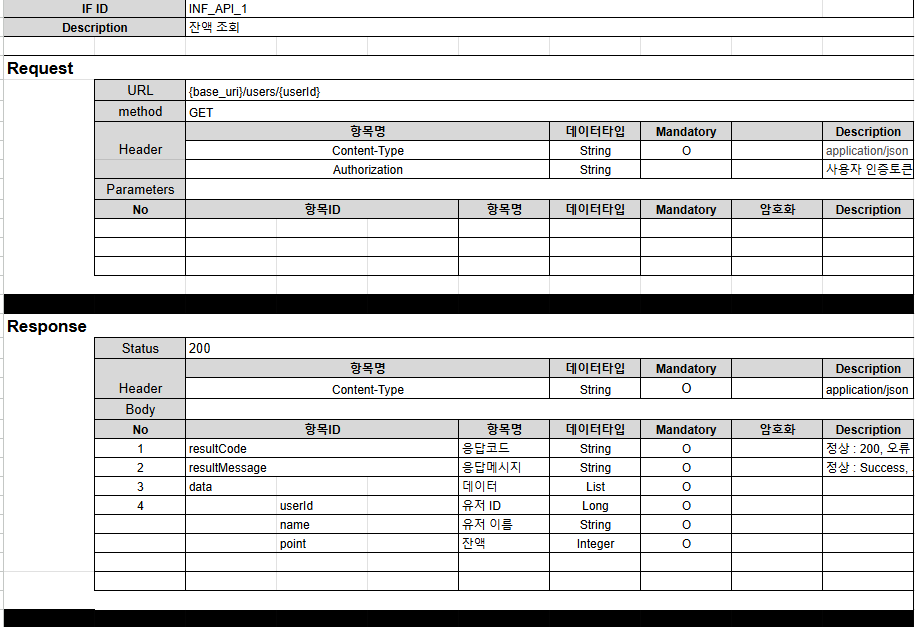
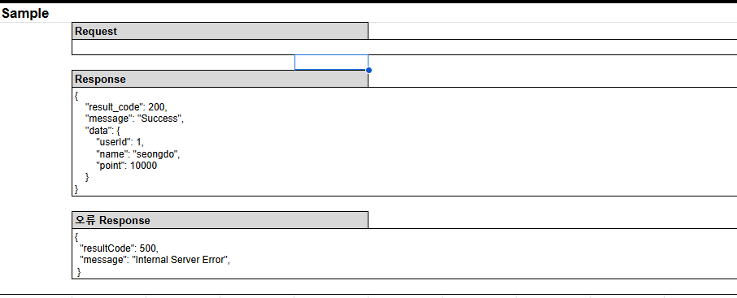

### 2. 잔액 충전
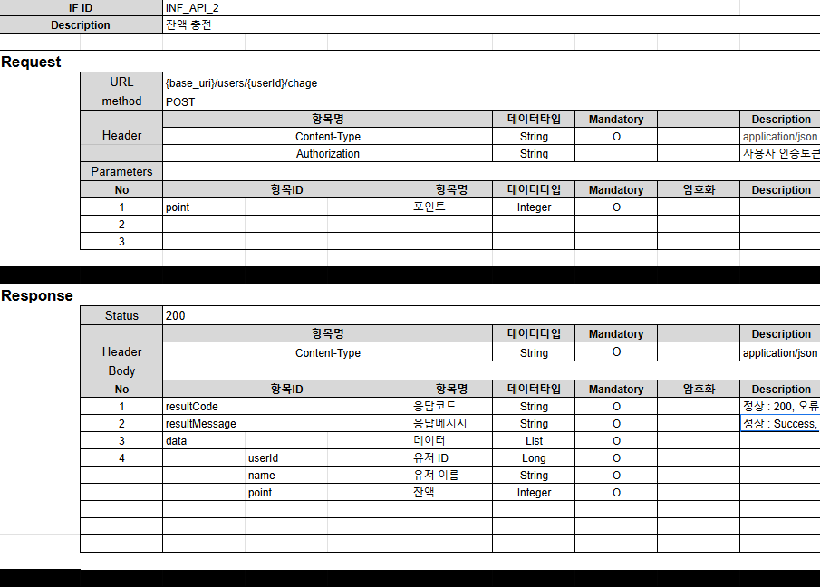
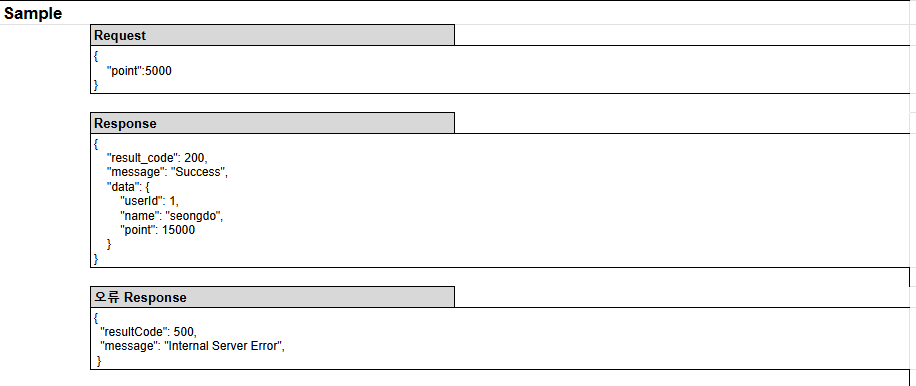

### 3. 상품 조회
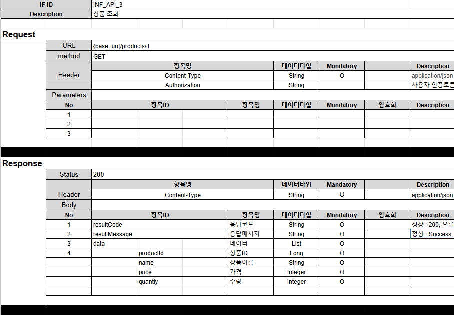
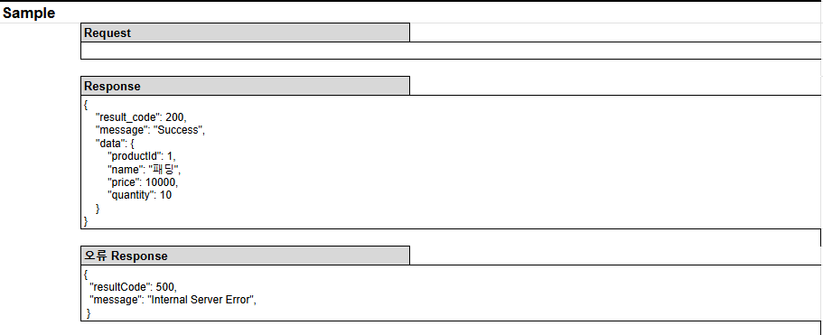

### 4. 주문 및 결제
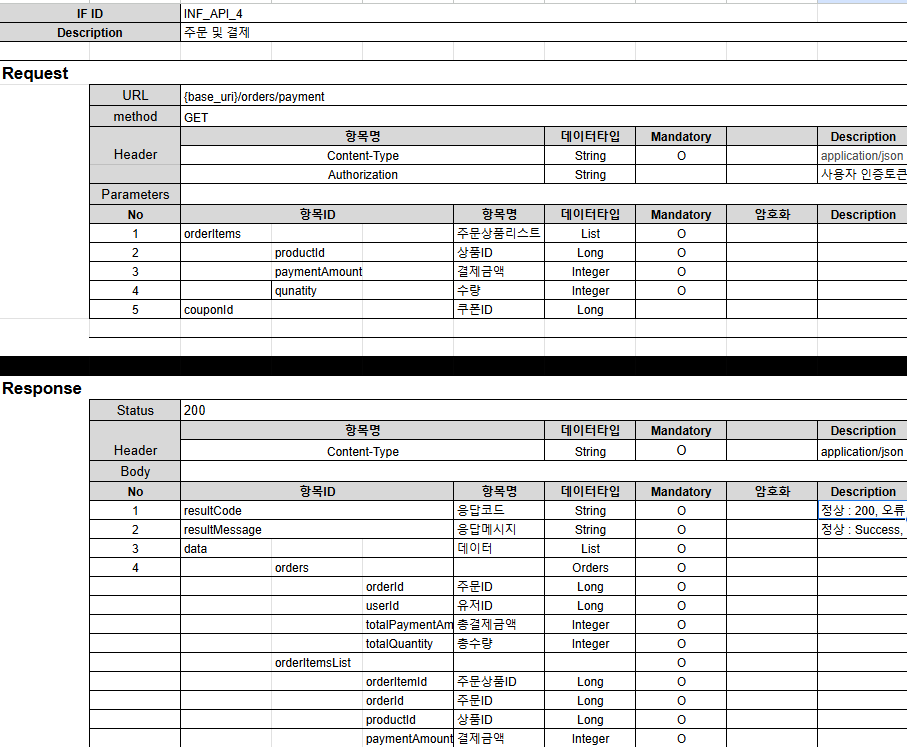
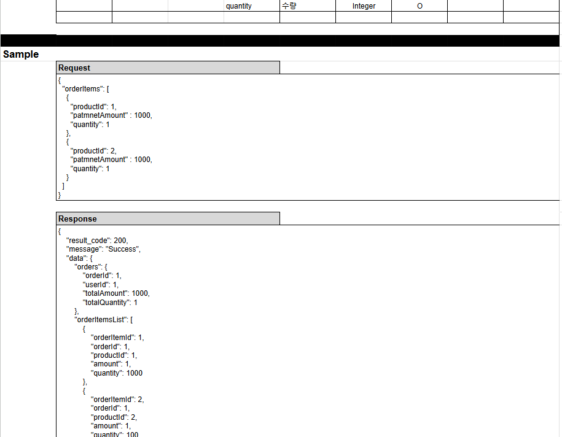
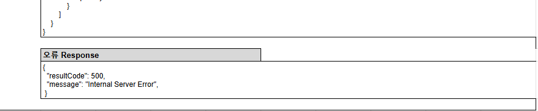

### 5. 쿠폰 발급
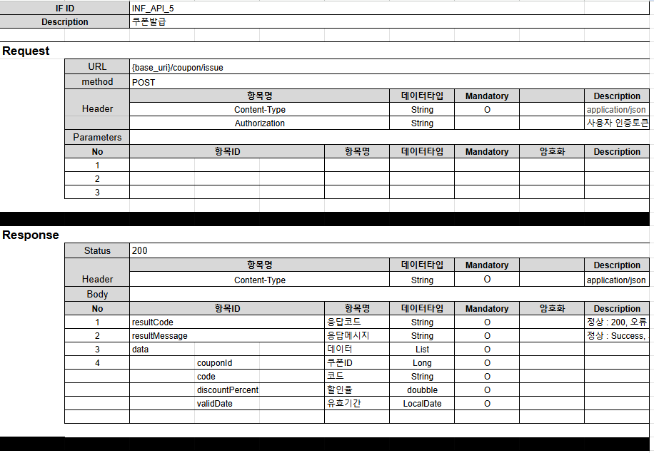
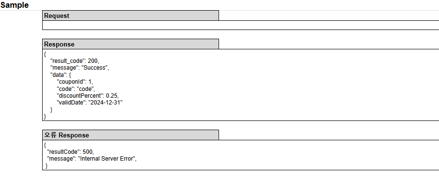

### 6. 인기 상품 조회

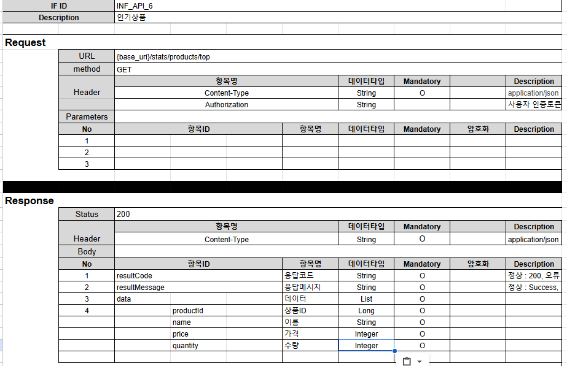
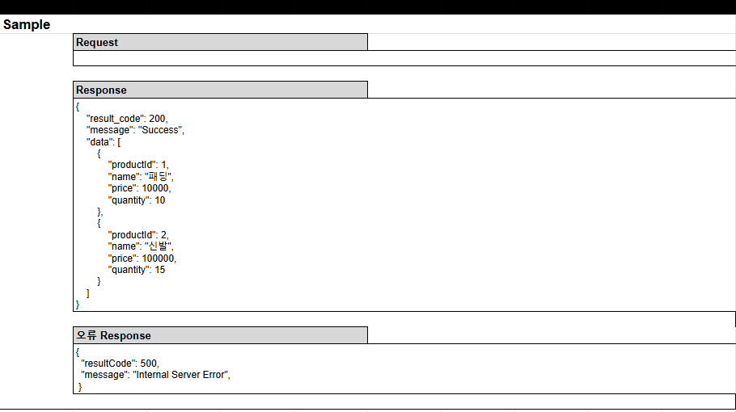