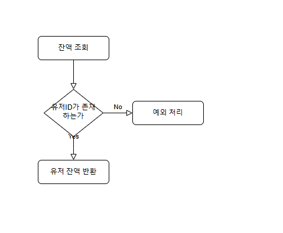
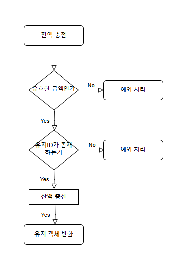
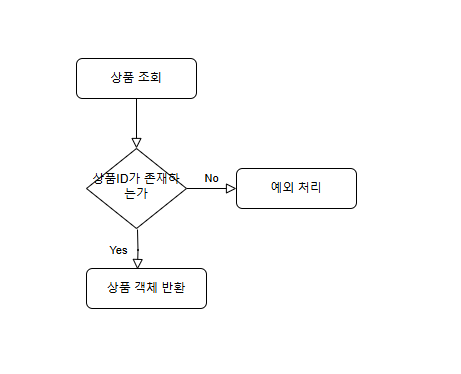
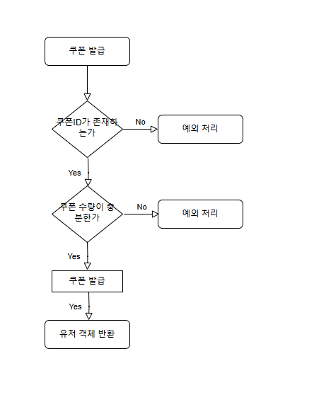
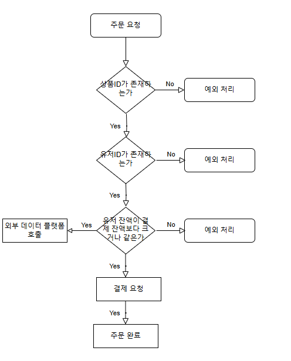

# Flow Chart
---
1. [잔액 조회](#1-잔액-조회)
2. [잔액 충전](#2-잔액-충전)
3. [상품 조회](#3-상품-조회)
4. [쿠폰 발급](#4-쿠폰-발급)
5. [주문 및 결제](#5-주문-및-결제)

[README](../README.md)

### 1. 잔액 조회

**설명**
**1. 잔액 조회 요청**
- 사용자가 잔액 조회 요청을 보냄으로써 시작됩니다.
**2. 조건 확인: 사용자 ID가 존재하는가?**
- 시스템은 요청받은 사용자 ID(userId)를 기준으로 데이터베이스를 조회하여 사용자가 존재하는지 확인합니다.

    Yes:
    사용자 ID가 데이터베이스에 존재하면, 다음 단계로 진행됩니다.

    No:
    사용자 ID가 데이터베이스에 존재하지 않을 경우, 예외 처리로 분기됩니다.

**3. 예외 처리**
- 사용자 ID가 존재하지 않는 경우, 시스템은 적절한 예외 처리를 수행합니다.

**4. 사용자 잔액 반환**
- 사용자 ID가 확인되면, 해당 사용자의 잔액 정보를 반환합니다.
반환된 잔액 정보는 사용자에게 전달됩니다.
### 2. 잔액 충전

**설명**
**1. 잔액 충전 요청**
- 사용자가 잔액 충전을 요청하며, 요청 데이터에는 충전 금액 및 사용자 ID(userId)가 포함됩니다.

**2. 유효한 금액인가?**
- 시스템은 충전 금액이 유효한지 확인합니다.

    Yes:
    금액이 유효하다면 다음 단계로 진행됩니다.

    No:
    금액이 유효하지 않은 경우, 예외 처리를 수행합니다.

**3. 사용자 ID가 존재하는가?**
- 시스템은 사용자 ID(userId)가 데이터베이스에 존재하는지 확인합니다.
    
    Yes:
    사용자 ID가 존재하면, 다음 단계로 진행됩니다.
    
    No:
    사용자 ID가 존재하지 않는 경우, 예외 처리를 수행합니다.

**4. 잔액 충전**
- 사용자 계정의 잔액에 요청된 금액을 추가합니다.

**5. 사용자 객체 반환**
- 충전 완료 후, 업데이트된 사용자 정보를 반환합니다.

### 3. 상품 조회

**설명**

**1. 상품 조회 요청**
- 사용자가 상품 조회 요청을 보냄으로써 시작됩니다.

**2. 조건 확인: 상품 ID가 존재하는가?**
- 시스템은 요청받은 상품 ID(userId)를 기준으로 데이터베이스를 조회하여 사용자가 존재하는지 확인합니다.

    Yes:
    상품 ID가 데이터베이스에 존재하면, 다음 단계로 진행됩니다.

    No:
    상품 ID가 데이터베이스에 존재하지 않을 경우, 예외 처리로 분기됩니다.

**3. 예외 처리**
- 상품 ID가 존재하지 않는 경우, 시스템은 적절한 예외 처리를 수행합니다.

**4. 사용자 잔액 반환**
- 상품 ID가 확인되면, 해당 상품을 사용자에게 반환합니다.
### 4. 쿠폰 발급

**설명**
**1. 쿠폰 발급 요청**
- 사용자가 쿠폰 발급 요청을 보냅니다. 

**2. 쿠폰 ID가 존재하는가?**
- 시스템은 요청된 couponId가 데이터베이스에 존재하는지 확인합니다.

    Yes:
    쿠폰 ID가 존재하면 다음 단계로 진행합니다.

    No:
    쿠폰 ID가 존재하지 않을 경우, 예외 처리를 수행합니다.

**3. 쿠폰 수량이 충분한가?**
- 시스템은 요청된 쿠폰의 남은 수량을 확인합니다.
    Yes:
    쿠폰 수량이 충분하다면, 쿠폰 발급 프로세스를 진행합니다.

    No:
    쿠폰 수량이 부족할 경우, 예외 처리를 수행합니다.

**4. 쿠폰 발급**
- 쿠폰 발급이 이루어집니다.
사용자의 계정에 쿠폰이 할당됩니다.

**5. 사용자 객체 반환**
- 성공적으로 쿠폰이 발급되면, 업데이트된 사용자 정보를 반환합니다.
사용자에게 성공 메시지가 전달됩니다.

### 5. 주문 및 결제

**설명**

**1. 주문 요청**
- 사용자가 상품 주문 요청을 보냅니다.

**2. 상품 ID가 존재하는가?**
- 시스템은 요청된 productId가 데이터베이스에 존재하는지 확인합니다.

    Yes:
    상품 ID가 존재하면 다음 단계로 진행합니다.

    No:
    상품 ID가 데이터베이스에 존재하지 않을 경우, 예외 처리를 수행합니다.

**3. 사용자 ID가 존재하는가?**
- 시스템은 userId가 데이터베이스에 존재하는지 확인합니다.

    Yes:
    사용자 ID가 유효하다면 다음 단계로 진행합니다.

    No:
    사용자 ID가 존재하지 않을 경우, 예외 처리를 수행합니다.

**4. 사용자 잔액이 결제 금액보다 크거나 같은가?**
- 시스템은 사용자의 잔액을 확인하고, 결제 금액을 충당할 수 있는지 확인합니다.

    Yes:
    잔액이 충분하면 다음 단계로 진행합니다.

    No:
    잔액이 부족할 경우, 예외 처리를 수행합니다.

**5. 외부 데이터 플랫폼 호출**
- 외부 데이터 플랫폼에 데이터 전송을 위한 API를 호출합니다.

**6. 결제 요청**
- 결제 요청이 최종적으로 이루어집니다.
결제가 성공적으로 완료되면 주문 상태를 업데이트합니다.

**7. 주문 완료**
- 모든 과정이 성공적으로 수행되면, 시스템은 "주문 완료" 상태를 사용자에게 반환합니다.
