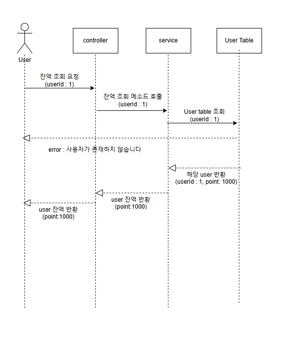
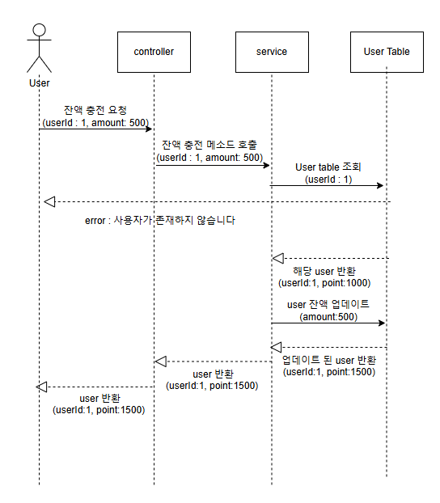
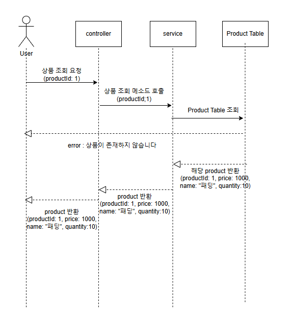
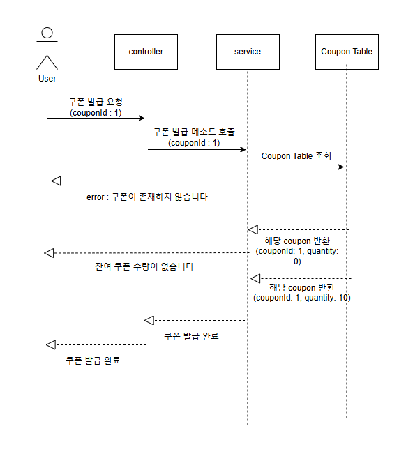
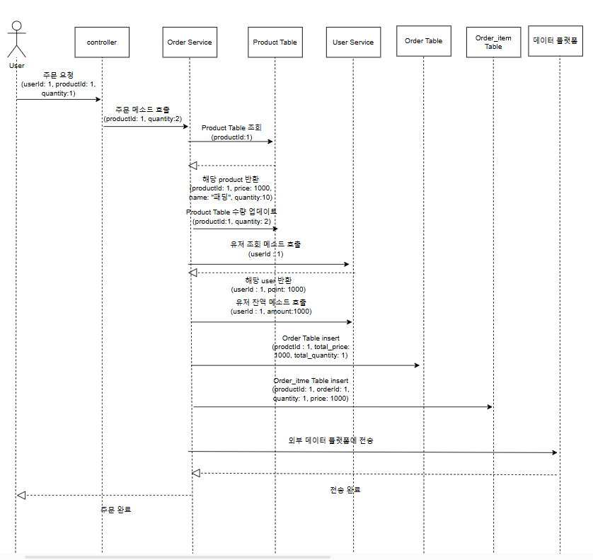
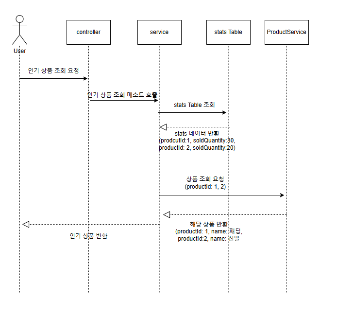

# Sequence Diagram
---
1. [잔액 조회](#1-잔액-조회)
2. [잔액 충전](#2-잔액-충전)
3. [상품 조회](#3-상품-조회)
4. [쿠폰 발급](#4-쿠폰-발급)
5. [주문 및 결제](#5-주문-및-결제)
6. [인기 상품 조회](#6-인기-상품-조회)

[README](../README.md)

### 1. 잔액 조회

**설명**
1. 사용자 요청
- 사용자가 잔액 조회 요청을 보냅니다. 이 요청에는 사용자 식별자(userId: 1)가 포함되어 있습니다.

2. Controller 처리:
컨트롤러는 잔액 조회 메소드를 호출하여 서비스 계층에 요청을 전달합니다. userId: 1 정보가 포합됩니다.

3. Service 처리
- 서비스 계층은 데이터베이스(User Table)를 조회합니다. userId: 1을 사용하여 조회합니다.

4. User Table 응답
- 데이터베이스(User Table)는 요청한 사용자 정보를 반환합니다. 여기서 반환된 정보는 userId: 1 에 해당하는 User 정보입니다.

5. Error 처리
- 만약 데이터베이스에서 사용자가 존재하지 않는 경우 컨트롤러에 "사용자가 존재하지 않습니다"라는 에러 메시지를 반환합니다.

6. 잔액 반환
- 사용자가 존재하는 경우, 서비스는 해당 사용자의 잔액 정보를 컨트롤러에 전달합니다.
컨트롤러는 사용자에게 잔액(point: 1000)을 반환합니다.

### 2. 잔액 충전
**설명**

1. 사용자 요청
- 사용자가 잔액을 충전하기 위해 잔액 충전 요청을 보냅니다. 이 요청에는 사용자 ID(userId: 1)와 충전 금액(amount:500)이 포함됩니다.

2. Controller 처리
- 컨트롤러는 잔액 충전 메소드를 호출하여 서비스 계층에 요청을 전달합니다. userId: 1과 amount: 500이 포함됩니다.

3. Service 처리 
- 서비스 계층은 데이터베이스(User Table)를 조회합니다. serId: 1을 사용하여 조회합니다.

4. error 처리
- 만약 데이터베이스에서 사용자가 존재하지 않는 경우 컨트롤러에 "사용자가 존재하지 않습니다"라는 에러 메시지를 반환합니다.

5. User Table 업데이트
- 사용자가 존재할 경우, 반환된 사용자 정보를 바탕으로 충전 금액(amount: 500)을 기존 잔액에 추가하고 데이터베이스에 업데이트 합니다.
그 후 업데이트된 User를 반환합니다

6. 응답 반환
- 서비스 계층은 업데이트된 사용자 정보를 컨트롤러에 전달한 후 컨트롤러는 해당 User 객체를 반환합니다.

### 3. 상품 조회

**설명**
1. 사용자 요청
- 사용자가 상품 조회를 위한 요청을 보냅니다. 이 요청에는 상품 식별자(productId: 1)가 포함되어 있습니다.

2. Controller 처리
- 컨트롤러는 상품 조회 메소드를 호출하여 서비스 계층에 요청을 전달합니다. productId: 1 정보가 포합됩니다.

3. Service 처리
- 서비스 계층은 데이터베이스(Product Table)를 조회합니다. productId: 1을 사용하여 조회합니다.

4. Product Table 응답
- 데이터베이스(Product Table)는 요청한 상품 정보를 반환합니다. 여기서 반환된 정보는 productId: 1 에 해당하는 Product 정보입니다.

5. Error 처리
- 만약 데이터베이스에서 상품이 존재하지 않는 경우 컨트롤러에 "상품이 존재하지 않습니다"라는 에러 메시지를 반환합니다.

6. 상품 반환
- 상품이 존재하는 경우, 서비스는 해당 상품의 정보를 컨트롤러에 전달합니다.
컨트롤러는 사용자에게 상품 객체를 반환합니다.
### 4. 쿠폰 발급

**설명**
1. 사용자 요청
- 사용자가 쿠폰 발급을 위해 잔액 충전 요청을 보냅니다.이 요청에는 상품 식별자(couponId: 1)가 포함되어 있습니다.

2. Controller 처리
- 컨트롤러는 쿠폰 발급 메소드를 호출하여 서비스 계층에 요청을 전달합니다. couponId: 1 정보가 포합됩니다.

3. Service 처리 
- 서비스 계층은 데이터베이스(Coupon Table)를 조회합니다. couponId: 1을 사용하여 조회합니다.

4. error 처리
- 만약 데이터베이스에서 쿠폰이 존재하지 않는 경우 컨트롤러에 "쿠폰이 존재하지 않습니다"라는 에러 메시지를 반환합니다.

5. 쿠폰 수량확인
- 쿠폰이 존재할 경우, 쿠폰의 잔여수량을 확인 후 쿠폰이 없으면 "잔여 쿠폰 수량이 없습니다" 라는 에러 메세지를 반환합니다.

6. 잔여 쿠폰
- 서비스 계층은 수량이 있는 쿠폰을 반환받고 컨트롤러에 해당 쿠폰을 전달합니다.

7. 응답 반환
- 컨트롤러는 해당 쿠폰 객체를 반환합니다.
### 5. 주문 및 결제

**설명**
1. 사용자 요청
사용자가 상품 주문 요청을 보냅니다.
요청에는 사용자 ID(userId: 1), 상품 ID(productId: 1), 수량(quantity: 2)이 포함됩니다.

2. Controller 처리
컨트롤러는 사용자의 주문 요청을 수신하고, 이를 주문 서비스(Order Service)에 전달합니다.

3. 주문 서비스 처리
    1. 상품 정보 조회:
        - 주문 서비스는 상품의 유효성을 확인하기 위해 Product Table을 조회합니다.
        - productId: 1로 요청하여 상품 정보를 확인합니다.
        - 상품이 존재하면, 가격(price: 1000)과 재고 수량(quantity: 5)을 반환합니다.
        - 만약 상품이 존재하지 않거나 재고가 부족하면 적절한 에러 메시지를 반환합니다.
    2. 사용자 잔액 조회:
        - 주문 서비스는 User Service를 통해 사용자 정보를 확인합니다.
        - userId: 1을 사용하여 잔액 정보를 조회합니다.
        - 잔액이 충분하지 않을 경우, 적절한 에러 메시지를 반환합니다.
    3. 주문 데이터 생성:
        - 주문 가능 상태인 경우, 주문 데이터를 생성하여 Order Table과 Order Item Table에 삽입합니다.
        - Order Table에 주문 정보 삽입 (userId: 1, total price: 2000)
        - Order Item Table에 상품별 주문 항목 삽입 (productId: 1, quantity: 2, price: 1000)
    4. 재고 업데이트:
        - Product Table에서 재고 수량을 감소시킵니다 (quantity: 5 -> 3)
    5. 잔액 차감:
        - User Table에서 사용자의 잔액을 차감합니다 (balance: 5000 -> 3000)

4. 외부 데이터 플랫폼 전송
- 외부 데이터 플랫폼 전송을 위해 위부 api를 호출합니다.

5. 데이터 저장 및 최종 응답
- 모든 데이터가 성공적으로 처리되면 주문 결과를 사용자에게 반환합니다.
반환 내용: 주문 번호, 주문된 상품 정보, 최종 결제 금액, 잔여 잔액 등.
### 6. 인기 상품 조회

**설명**
1. 사용자 요청
- 사용자가 인기 상품 조회 요청을 보냅니다.

2. Controller 처리
- 컨트롤러는 사용자의 요청을 수신합니다.
인기 상품 조회 메소드를 호출하여 서비스 계층으로 요청을 전달합니다.

3. Service 처리
- 서비스 계층은 인기 상품 정보를 확인하기 위해 stats Table을 조회합니다.
반환된 데이터를 기반으로 인기 상품 순위를 결정합니다.
.
4. 최종 응답
- 서비스 계층에서 받은 인기 상품 정보를 컨트롤러로 반환합니다.
컨트롤러는 최종적으로 사용자에게 인기 상품 데이터를 전달합니다.
